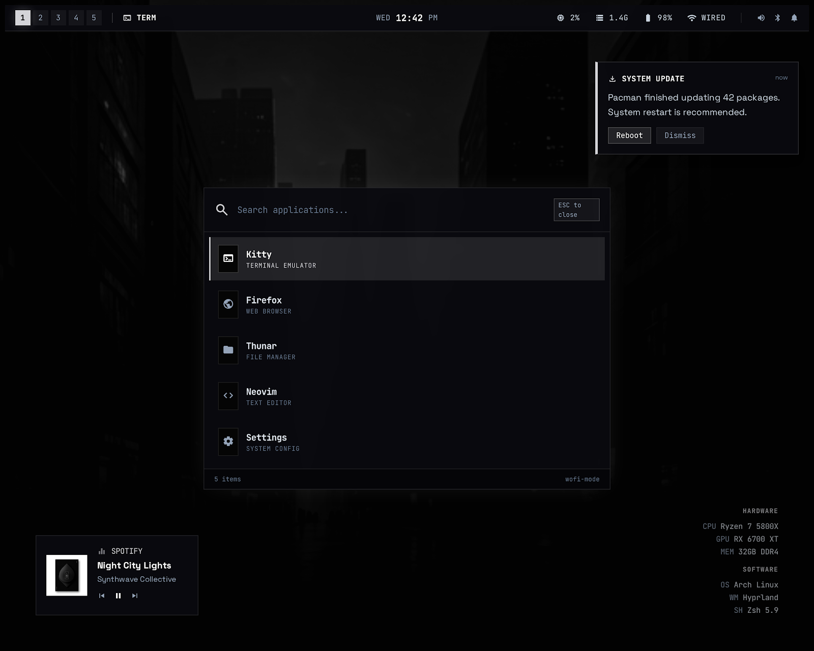

# Terminal Noir

Terminal Noir is a monochrome Hyprland rice for Arch-style systems. It is built around sharp geometry, JetBrains Mono, dark grey surfaces, custom Quickshell panels, Waybar, Rofi workflows, a themed SDDM login screen, and scripted setup/verification.

The goal is a full desktop environment that feels like a precise terminal-first workstation, not a collection of disconnected dotfiles.



## Highlights

| Area | What is included |
| --- | --- |
| Window manager | Hyprland config split into env, startup, keybindings, monitors, user prefs, and rules |
| Bar and shell | Waybar plus Quickshell widgets for control center, notifications, clipboard, calendar, media, stats, Wi-Fi, Bluetooth, audio, and settings |
| Theme | Monochrome GTK, Qt, Kvantum, KDE/Dolphin, Rofi, Kitty, Wlogout, SwayOSD, Vim, Code, Spotify/Spicetify, and SDDM styling |
| Launcher workflow | Rofi app launcher, file picker, web search, emoji picker, glyph picker, screenshot menu, color picker |
| Clipboard | `cliphist`, Quickshell clipboard panel, pinned clipboard support, and `wl-clip-persist` for regular Wayland clipboard persistence |
| Screenshots | Single `Print` key menu with area/fullscreen/monitor, clipboard/file, annotation, color picker, and recording toggle |
| Login screen | Terminal Noir SDDM theme based on the sddm-astronaut structure with blurred wallpaper and manual virtual keyboard toggle |
| Safety | Backup, restore, uninstall, dry-run, package manifest, and `verify-rice.sh` health checks |

## Design Language

Terminal Noir follows the design source in [designs/DESIGN.md](designs/DESIGN.md).

Core rules:

- Monochrome only: black, near-black, dark grey, muted grey, white.
- Sharp geometry: no rounded UI corners.
- Dense utility-first layout.
- JetBrains Mono Nerd Font across the shell.
- Borders and tonal layering instead of shadows.
- Background blur is used where it helps depth, but the UI stays readable and restrained.

Key colors:

| Token | Value |
| --- | --- |
| Background | `#141313` |
| Lowest surface | `#0e0e0e` |
| Raised surface | `#1c1b1b` |
| High surface | `#2a2a2a` |
| Highest surface | `#353434` |
| Text | `#e5e2e1` |
| Muted text | `#c4c7c8` |
| Outline | `#444748` |

## Screens

| Surface | Reference |
| --- | --- |
| Home | [designs/home-screen.png](designs/home-screen.png) |
| Waybar | [designs/waybar.png](designs/waybar.png) |
| Quick panel | [designs/quick-panel.png](designs/quick-panel.png) |
| Lock screen | [designs/lockscreen.png](designs/lockscreen.png) |
| Logout menu | [designs/logout.png](designs/logout.png) |
| App launcher | [designs/applauncher.png](designs/applauncher.png) |
| Notifications | [designs/notification.png](designs/notification.png) |

## Requirements

This repo targets Arch Linux, EndeavourOS, and other Arch-like systems.

Required before running the installer:

- `yay`
- `sudo`
- a Wayland session
- Git
- internet access for package installation and font download

Recommended services:

```bash
sudo systemctl enable --now NetworkManager.service
sudo systemctl enable --now bluetooth.service
```

Recommended display manager:

```bash
sudo systemctl enable sddm.service
```

## Repository Layout

| Path | Purpose |
| --- | --- |
| `.config/hypr/` | Hyprland env, startup, keybindings, rules, idle, lock, and helper scripts |
| `.config/quickshell/` | Quickshell shell, panels, widgets, and state scripts |
| `.config/waybar/` | Waybar layout and Terminal Noir styling |
| `.config/rofi/` | Rofi themes and clipboard launcher |
| `.config/wlogout/` | Logout and power menu |
| `.config/kitty/` | Terminal theme |
| `.config/swayosd/` | Volume and brightness OSD theme |
| `.config/gtk-3.0/`, `.config/gtk-4.0/` | GTK settings and CSS |
| `.config/qt5ct/`, `.config/qt6ct/`, `.config/Kvantum/` | Qt and Kvantum theme config |
| `.config/kdeglobals`, `.config/dolphinrc` | KDE/Dolphin readable dark theme |
| `.config/vim/`, `.config/Code*`, `.config/spicetify/` | App-specific theme integrations |
| `.local/bin/tnctl` | Main helper command dispatcher |
| `.local/lib/terminal-noir/` | Wallpaper, theme, waybar, rofi, screenshot, window, media, system, clipboard, weather, and update helpers |
| `.local/share/terminal-noir/` | Runtime data used by Terminal Noir helpers |
| `sddm/terminal-noir/` | SDDM login theme |
| `scripts/` | Install, sync, backup, restore, uninstall, and SDDM setup scripts |
| `tests/` | Shell verification checks for config, install, panels, app theming, workflow utilities, and theme engine |
| `verify-rice.sh` | End-to-end local health check |

## Quick Start

From a fresh checkout:

```bash
git clone https://github.com/n4bi10p/rice.git ~/Buildbox/rice
cd ~/Buildbox/rice
```

Preview the install actions:

```bash
scripts/install.sh --all --sync-config --install-sddm --dry-run
```

Install packages, sync user config, and install the SDDM theme:

```bash
scripts/install.sh --all --sync-config --install-sddm
```

Install the JetBrains Mono Nerd Font if it is missing:

```bash
./install_fonts.sh
```

Verify the result:

```bash
./verify-rice.sh
```

Reload Hyprland after config sync:

```bash
hyprctl reload
```

For the login screen, reboot or restart SDDM after installing the SDDM theme:

```bash
sudo systemctl restart sddm.service
```

Restarting SDDM closes the current graphical session. Save work first.

## Safer Staged Install

Use this route if you want to inspect each step.

1. Install packages only:

```bash
scripts/install.sh --all
```

2. Sync dotfiles only:

```bash
scripts/install.sh --no-packages --sync-config
```

3. Install SDDM theme only:

```bash
scripts/install.sh --no-packages --install-sddm
```

4. Verify:

```bash
./verify-rice.sh
```

## Minimal Install

If you only want the required runtime packages:

```bash
scripts/install.sh --required-only
scripts/install.sh --no-packages --sync-config
```

Recommended packages are still useful. They cover theming tools, screenshot helpers, media controls, portals, shell utilities, SDDM, app theming, weather, monitor tools, and fallbacks.

## Package Manifest

Packages are declared in [scripts/pkg_core.lst](scripts/pkg_core.lst).

Format:

```text
command-or-path|package-name|required-or-recommended|description
```

`verify-rice.sh` reads this manifest. Entries can be commands such as `hyprland`, or concrete artifact paths such as:

```text
/usr/lib/qt6/plugins/platforms/libqwayland.so|qt6-wayland|recommended|Qt6 Wayland platform support
/usr/share/fonts/noto/NotoColorEmoji.ttf|noto-fonts-emoji|recommended|Emoji font coverage
```

Install everything from the manifest:

```bash
scripts/install.sh --all
```

Install required packages only:

```bash
scripts/install.sh --required-only
```

Manual cleanup command for the commonly missed recommended packages:

```bash
yay -S --needed nwg-look qt5ct qt6ct kvantum kvantum-qt5 starship bat eza wttrbar ddcui
```

## Config Sync

The sync script copies the repo-managed `.config`, `.local`, and root dotfiles into a target home.

```bash
scripts/sync-config.sh --target-home "$HOME"
```

Dry run:

```bash
scripts/sync-config.sh --target-home "$HOME" --dry-run
```

Before copying, matching live paths are backed up under:

```text
~/.config/cfg_backups/terminal-noir-YYYYMMDD-HHMMSS
```

Unrelated files in the target directories are preserved.

The sync script also rewrites the `qt5ct` and `qt6ct` stylesheet paths so they point at the live `terminal-noir.qss` file.

## SDDM Theme

Install the login theme:

```bash
scripts/install-sddm-theme.sh
```

The installer:

- copies `sddm/terminal-noir` to `/usr/share/sddm/themes/terminal-noir`
- copies the wallpaper to the theme directory
- generates a blurred login background with ImageMagick when available
- writes `/etc/sddm.conf.d/terminal-noir.conf`
- updates `/etc/sddm.conf` to use `Current=terminal-noir`
- backs up existing SDDM config under `/etc/sddm.conf.d/terminal-noir-backups`

The SDDM virtual keyboard is manual. It should not pop up automatically while typing; use the keyboard toggle in the login UI when needed.

## Verification

Run the full verifier:

```bash
./verify-rice.sh
```

Expected result on a fully installed system:

```text
Verification passed with 0 warning(s).
```

Run focused checks:

```bash
bash tests/verify-foundation.sh
bash tests/verify-installation.sh
bash tests/verify-panel-behavior.sh
bash tests/verify-control-layer.sh
bash tests/verify-workflow-utilities.sh
bash tests/verify-app-theming.sh
bash tests/verify-theme-engine.sh
```

Run whitespace validation before commit:

```bash
git diff --check
```

If `verify-rice.sh` reports live-session warnings from an automation shell, run it from a real terminal inside the Hyprland session. The live checks need access to the Hyprland socket and system/user service buses.

## Keybindings

| Key | Action |
| --- | --- |
| `SUPER + T` | Open Kitty |
| `SUPER + Space` | App launcher |
| `SUPER + /` | Keybinding help |
| `SUPER + V` | Clipboard panel |
| `SUPER + .` | Emoji picker |
| `SUPER + CTRL + L` | Lock screen |
| `SUPER + M` | Logout menu |
| `SUPER + Q` | Close focused window |
| `SUPER + SHIFT + V` | Toggle floating |
| `SUPER + F` | Fullscreen |
| `SUPER + H/J/K/L` | Move focus |
| `SUPER + SHIFT + H/J/K/L` | Move focused window |
| `SUPER + 1..5` | Switch workspace |
| `SUPER + SHIFT + 1..5` | Move window to workspace |
| `Print` | Screenshot menu |
| `SUPER + SHIFT + P` | Color picker |
| `Fn + F1` / `XF86AudioMute` | Mute volume |
| `Fn + F2` / `XF86AudioLowerVolume` | Volume down |
| `Fn + F3` / `XF86AudioRaiseVolume` | Volume up |
| `Fn + F9` / `XF86MonBrightnessDown` | Brightness down |
| `Fn + F10` / `XF86MonBrightnessUp` | Brightness up |

The same list is available in-session with:

```bash
SUPER + /
```

## `tnctl`

`tnctl` is the main Terminal Noir command dispatcher.

```bash
tnctl <command-group> <action> [args...]
```

Command groups:

| Group | Purpose |
| --- | --- |
| `wallpaper` | Wallpaper selection and application |
| `theme` | Theme reload and status |
| `waybar` | Waybar reload/toggle |
| `rofi` | Rofi app, window, file, web, emoji, and glyph menus |
| `screenshot` | Screenshot menu and capture helpers |
| `window` | Focused-window helpers |
| `media` | MPRIS/media helpers |
| `system` | Shell, OSD, and service helpers |
| `clipboard` | Clipboard panel helper |
| `weather` | Weather provider helper |
| `updates` | Package update helper |

Examples:

```bash
tnctl clipboard open
tnctl screenshot menu
tnctl rofi apps
tnctl rofi emoji
tnctl rofi web "arch hyprland"
tnctl waybar reload
tnctl theme reload
```

## Clipboard

Clipboard support uses:

- `wl-clipboard`
- `cliphist`
- Quickshell clipboard panel
- `wl-clip-persist --clipboard regular`

Startup config runs:

```ini
exec-once = sh -lc 'command -v wl-clip-persist >/dev/null 2>&1 && exec wl-clip-persist --clipboard regular'
exec-once = wl-paste --type text --watch cliphist store
exec-once = wl-paste --type image --watch cliphist store
```

Open clipboard:

```bash
SUPER + V
```

The clipboard panel includes normal history and pinned content.

## Emoji Picker

Open emoji picker:

```bash
SUPER + .
```

The picker uses the repo's Rofi helper and generates a Unicode emoji list from Perl's Unicode database when available. On a normal Arch install this gives over 2,000 entries. Selecting an entry copies it to the Wayland clipboard.

Required packages:

- `noto-fonts-emoji`
- `wl-clipboard`

Check count:

```bash
TNCTL_LIST_ITEMS=1 tnctl rofi emoji | wc -l
```

## Screenshot Menu

Open the screenshot menu:

```bash
Print
```

Actions:

- Area to clipboard
- Area to file
- Area annotate
- Fullscreen to clipboard
- Fullscreen to file
- Monitor to file
- Color picker
- Start recording / Stop recording

Screenshots are stored under:

```text
~/Pictures/Screenshots
```

Recordings are stored under:

```text
~/Videos/Recordings
```

## App Theming

Terminal Noir includes configs for:

| App/toolkit | Config |
| --- | --- |
| GTK 3/4 | `.config/gtk-3.0`, `.config/gtk-4.0`, `.gtkrc-2.0`, `xsettingsd` |
| Qt 5/6 | `qt5ct`, `qt6ct`, `Trolltech.conf` |
| Kvantum | `.config/Kvantum/TerminalNoir` |
| KDE/Dolphin | `.config/kdeglobals`, `.config/dolphinrc`, `.local/share/color-schemes/TerminalNoir.colors` |
| Kitty | `.config/kitty` |
| Rofi | `.config/rofi` |
| Vim | `.config/vim/colors/terminal-noir.vim` |
| Code / Code OSS / VSCodium | `.config/Code`, `.config/Code - OSS`, `.config/VSCodium`, flags files |
| Spotify | `.config/spotify-flags.conf`, `.config/spicetify/Themes/TerminalNoir` |
| SwayOSD | `.config/swayosd` |
| Wlogout | `.config/wlogout` |

After syncing configs, restart open apps that do not reload theme files dynamically.

## Backups

Create a backup:

```bash
scripts/backup-config.sh
```

Include SDDM config when running as root:

```bash
sudo scripts/backup-config.sh --include-sddm
```

Default backup root:

```text
~/.local/state/terminal-noir/backups
```

Preview:

```bash
scripts/backup-config.sh --dry-run
```

## Restore

Restore the latest backup:

```bash
scripts/restore-config.sh latest
```

Restore a specific backup:

```bash
scripts/restore-config.sh ~/.local/state/terminal-noir/backups/YYYYMMDD-HHMMSS
```

Preview:

```bash
scripts/restore-config.sh latest --dry-run
```

Restoring `/etc` SDDM config requires root.

## Uninstall

Remove Terminal Noir managed config files:

```bash
scripts/uninstall.sh
```

The uninstaller creates a backup first unless `--skip-backup` is passed.

Preview:

```bash
scripts/uninstall.sh --dry-run
```

Skip backup:

```bash
scripts/uninstall.sh --skip-backup
```

Packages are never removed by the uninstaller.

## Troubleshooting

### `verify-rice.sh` shows package warnings

Install the missing packages from the warning output:

```bash
yay -S --needed <package-name>
```

Then rerun:

```bash
./verify-rice.sh
```

### `verify-rice.sh` shows live-session warnings in an automation shell

Run it from a real terminal inside Hyprland:

```bash
./verify-rice.sh
```

Hyprland and service checks need real access to session sockets.

### Hyprland did not pick up changed keybindings

Reload:

```bash
hyprctl reload
```

### Waybar looks stale

Restart it:

```bash
tnctl waybar reload
```

### Emoji picker has missing glyphs

Install emoji fonts:

```bash
yay -S --needed noto-fonts-emoji
fc-cache -fv
```

### Qt apps ignore the theme

Confirm these packages exist:

```bash
pacman -Q qt5ct qt6ct kvantum kvantum-qt5 qt5-wayland qt6-wayland
```

Then log out and back in so `QT_QPA_PLATFORMTHEME` and `QT_STYLE_OVERRIDE` are imported into the session.

### SDDM theme did not change

Reinstall the theme and confirm SDDM uses it:

```bash
sudo scripts/install-sddm-theme.sh
grep -R "Current=terminal-noir" /etc/sddm.conf /etc/sddm.conf.d 2>/dev/null
```

Reboot or restart SDDM after saving work.

## Development Workflow

Before changing behavior:

```bash
bash tests/verify-foundation.sh
bash tests/verify-installation.sh
```

After changing shell helpers:

```bash
bash tests/verify-workflow-utilities.sh
```

After changing Quickshell panels:

```bash
bash tests/verify-panel-behavior.sh
bash tests/verify-control-layer.sh
```

After changing theme/app config:

```bash
bash tests/verify-app-theming.sh
bash tests/verify-theme-engine.sh
```

Final check:

```bash
./verify-rice.sh
git diff --check
```

## Current Health

On a fully synced and fully installed Terminal Noir system, the expected health check is:

```text
Verification passed with 0 warning(s).
```
